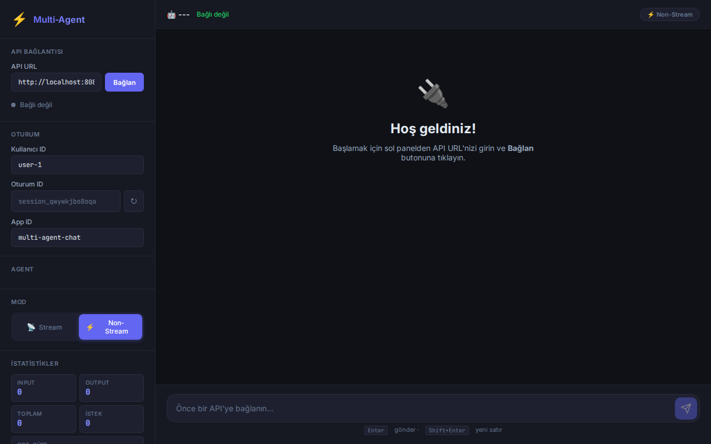
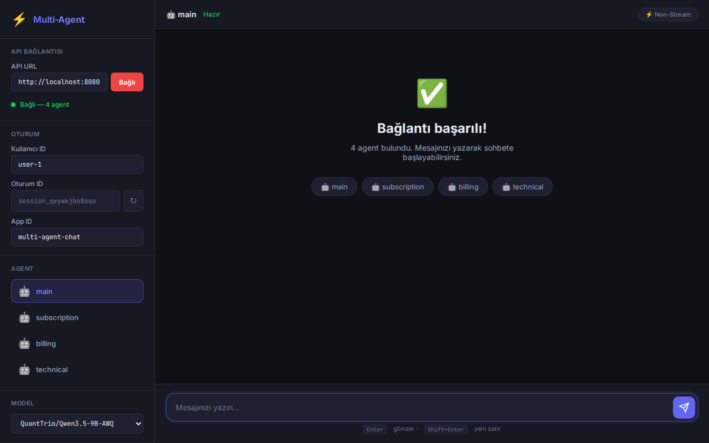
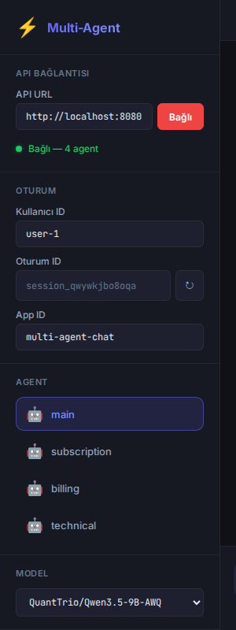

# Test UI

Proje ile birlikte gelen yerlesik test arayuzu. Agent'lari hizlica denemek, farkli modelleri test etmek ve API davranisini gozlemlemek icin tasarlandi.

**URL:** `http://localhost:{APP_PORT}/ui/`

---

## Genel Bakis



UI, FastAPI tarafindan static dosya olarak serve edilir (`/ui/` path'i). Ek kurulum gerektirmez — `python main.py` calistirdiginizda otomatik olarak erisime acilir.

---

## Baglanti



1. **API URL** alanina backend adresini girin (varsayilan: `http://localhost:8080`)
2. **Baglan** butonuna tiklayin
3. Basarili baglantiyla birlikte:
   - Mevcut agent'lar sidebar'da listelenir
   - Model dropdown'i vLLM'den mevcut modelleri ceker
   - Chat alani aktif olur

Baglanti durumu sidebar'da gosterilir:
- Yesil nokta + "Bagli — N agent" = basarili
- Kirmizi nokta + hata mesaji = baglanti hatasi

**Baglantiyi kesmek icin** yesil "Bagli" butonuna tekrar tiklayin.

---

## Sidebar



Sidebar su bolumleri icerir:

### API Baglantisi
API URL giris alani ve baglan/kes butonu.

### Oturum
- **Kullanici ID:** Composite thread_id'nin parcasi (`app_id:user_id:session_id`)
- **Oturum ID:** Otomatik uretilir. Yeni oturum icin yenile butonuna tiklayin
- **App ID:** Farkli uygulamalari izole etmek icin

### Agent
`GET /agents` endpoint'inden otomatik doldurulan agent listesi. Tikladiginiz agent aktif olur ve sonraki mesajlar bu agent'a gider.

### Model
vLLM'de yuklu modelleri gosteren dropdown. Model degisikligi aninda backend'e (`PUT /models/current`) iletilir. Farkli modelleri test etmek icin yeniden baglanmaya gerek yok.

### Mod
- **Stream:** `POST /chat/stream` (SSE) — token token yanitlari gorun
- **Non-Stream:** `POST /chat` — tam yaniti bekleyin

### Istatistikler
Toplam input/output/total token sayilari, istek sayisi ve ortalama sure.

---

## Chat Alani

Mesajinizi alt kisimdaki input alanina yazin:
- **Enter:** Mesaj gonder
- **Shift+Enter:** Yeni satir

Yanitlar Markdown olarak render edilir (kod bloklari, tablolar, listeler desteklenir).

### Stream Modu
Stream modunda yanitlar token token gelir. Yanit tamamlanana kadar progress bar aktif olur ve cursor animasyonu gosterilir.

### Non-Stream Modu
Tam yanit gelene kadar beklenir, sonra tek seferde gosterilir. Token usage istatistikleri bu modda guncellenir.

---

## API Endpoint'leri (UI Tarafindan Kullanilan)

| Endpoint | Method | Aciklama |
|---|---|---|
| `/agents?format=json` | GET | Agent listesi (baglanirken) |
| `/models` | GET | vLLM'deki mevcut modeller |
| `/models/current` | PUT | Aktif modeli degistir |
| `/chat` | POST | Non-stream chat istegi |
| `/chat/stream` | POST | SSE stream chat istegi |

### Model Endpoint'leri

```bash
# Mevcut modelleri listele
curl http://localhost:8080/models
# {"models": ["QuantTrio/Qwen3.5-9B-AWQ"], "current": "QuantTrio/Qwen3.5-9B-AWQ"}

# Aktif modeli degistir
curl -X PUT http://localhost:8080/models/current \
  -H "Content-Type: application/json" \
  -d '{"model": "Qwen/Qwen2.5-7B-Instruct-AWQ"}'
# {"current": "Qwen/Qwen2.5-7B-Instruct-AWQ"}
```

---

## Teknik Detaylar

### Dosya Yapisi

```
UI/
├── index.html    # Ana sayfa (sidebar + chat layout)
├── script.js     # Baglanti, agent/model secimi, chat mantigi
└── styles.css    # Dark theme, responsive tasarim
```

### Serve Edilmesi

`main.py`'de FastAPI `StaticFiles` ile mount edilir:

```python
app.mount("/ui", StaticFiles(directory="UI", html=True), name="ui")
```

### Gateway Secret ile Kullanim

`GATEWAY_SECRET` aktifken UI de dahil tum endpoint'ler korunur. Development'ta `GATEWAY_SECRET=` bos birakilarak kisitlamasiz erisim saglanir.

### Responsive Tasarim

- **Desktop (>900px):** Sidebar her zaman gorunur
- **Tablet/Mobil (<900px):** Sidebar hamburger menuye donusur, overlay ile acilir

---

## Ozellestirme

UI bir test araclidir — projenize ozel ihtiyaclara gore degistirilebilir:

- **Yeni sidebar bolumu:** `index.html`'e `sidebar-section` div'i ekleyin
- **Tema degisikligi:** `styles.css`'deki CSS variables'i duzenleyin (`:root` blogu)
- **Yeni SSE event tipleri:** `script.js`'deki `handleSSE()` fonksiyonuna case ekleyin
